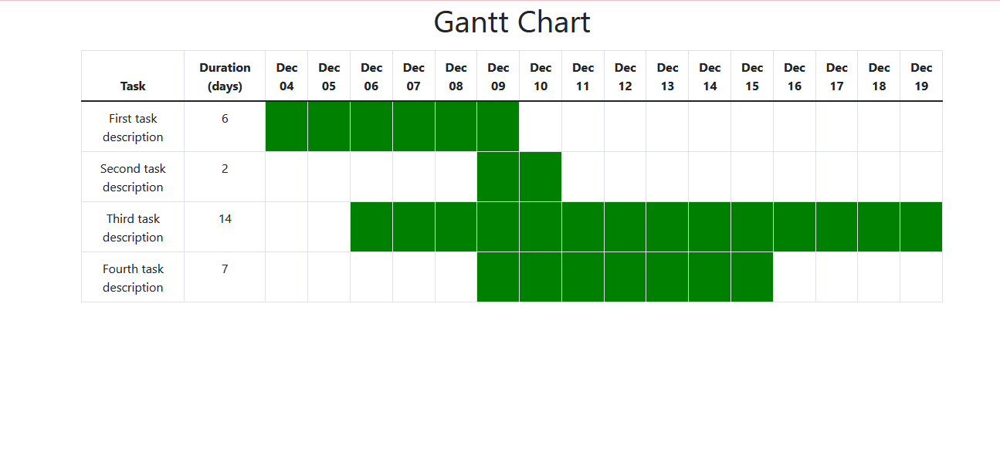

# Gantt Chart using PHP and BootStrap tables
Create a Gannt chart using data from PHP array using just a table

## Installation 
1. Clone/unzip the project into an Apache enabled directory
2. Visit project link from the browser 

## Demo 

